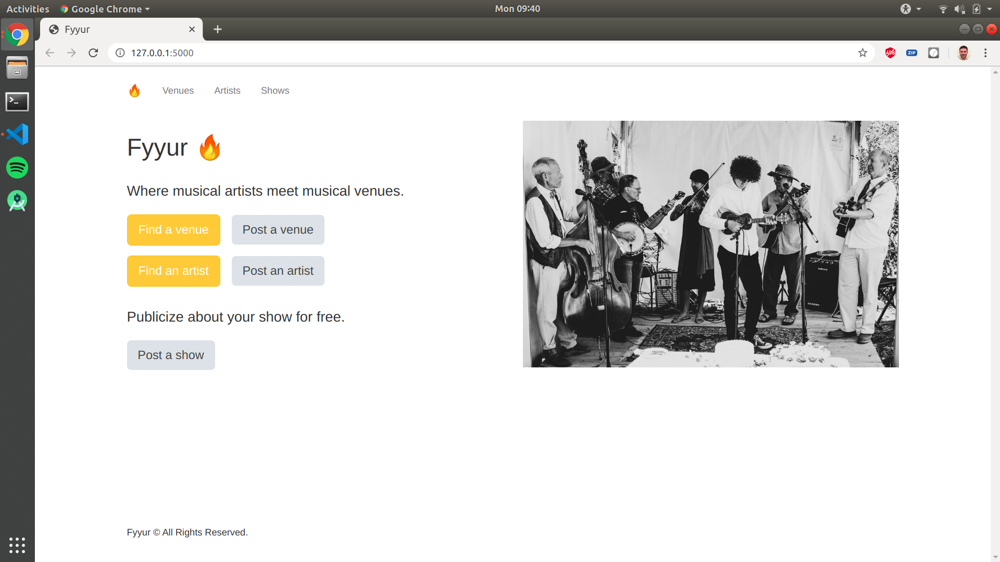

# Fyurr - musical artist and venue booking website

### Overview

Fyurr is a musical artist and venue booking website created for the [Full Stack Developer Nanodegree](https://www.udacity.com/course/full-stack-web-developer-nanodegree--nd0044) at Udacity.
The goal of the project was to:
- Connect the existing backend to a database
- Implement data models to store artist and venue data
- Create migration scripts to build all necessary database tables
- Replace all mock data with real data inserted to / queried from the database

The site runs on localhost and was created only for educational purposes.



### Tech stack

- **SQLAlchemy ORM** as the ORM library
- **PostgreSQL** as the database of choice
- **Python3** and **Flask** as the server language and server framework
- **Flask-Migrate** for creating and running schema migrations
- **HTML**, **CSS**, and **Javascript** with **Bootstrap 3** for the frontend

### Main files: Project Structure
```
├── README.md
├── app.py *** the main driver of the app. Includes the SQLAlchemy models.
                  "python app.py" to run after installing dependences
├── config.py *** Database URLs, CSRF generation, etc
├── error.log
├── forms.py *** All forms
├── requirements.txt *** The dependencies necessary to install with "pip3 install -r requirements.txt"
├── static
│   ├── css 
│   ├── font
│   ├── ico
│   ├── img
│   └── js
└── templates
    ├── errors
    ├── forms
    ├── layouts
    └── pages
```

### Development Setup

To start and run the local development server,
Initialize and activate a virtualenv:
```
$ cd YOUR_PROJECT_DIRECTORY_PATH/
$ virtualenv --no-site-packages env
$ source env/bin/activate
```
Install Flask & other dependencies:
```
$ pip install Flask
$ pip install -r requirements.txt
```
Run the development server:
```
$ export FLASK_APP=myapp
$ export FLASK_ENV=development # enables debug mode
$ python3 app.py
```
Navigate to Home page: http://localhost:5000
